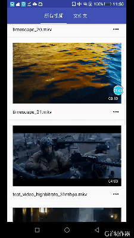

# Video

This repository shows how to display and play local video on Android.

This repository implements by kotlin+mvp+dagger2+rxkotlin

ScreenShot
----------

Pre-requisites
--------------

- Android Studio 3.x

Getting Started
---------------

This sample uses the Gradle build system. To build this project, use the
"gradlew build" command or use "Import Project" in Android Studio.

To do
-----
- video detail
- delete video
- multi mode

License
-------

Copyright 2018 koma_mj
 
Licensed under the Apache License, Version 2.0 (the "License");
you may not use this file except in compliance with the License.
You may obtain a copy of the License at
 
   http://www.apache.org/licenses/LICENSE-2.0
 
Unless required by applicable law or agreed to in writing, software
distributed under the License is distributed on an "AS IS" BASIS,
WITHOUT WARRANTIES OR CONDITIONS OF ANY KIND, either express or implied.
See the License for the specific language governing permissions and
limitations under the License.
